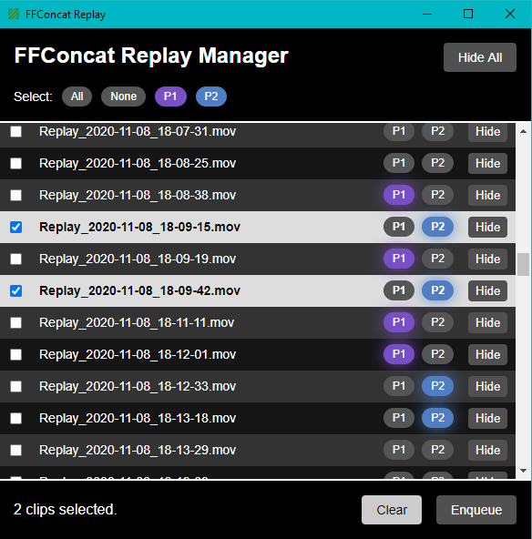
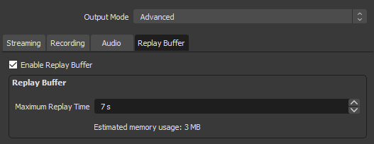
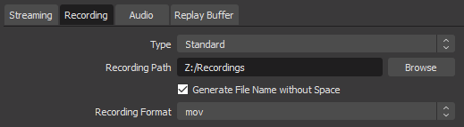
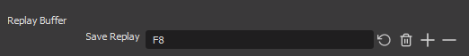
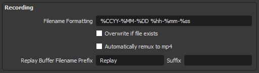
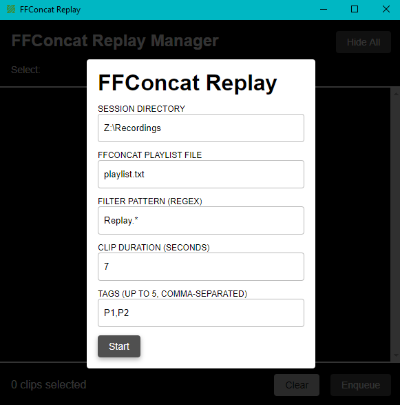
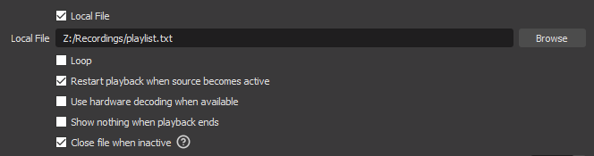

# FFConcat Replay Manager

A hacky way to get a much nicer-looking instant replay working in free open
source software. You can watch a demo of the resulting stream [here](https://www.youtube.com/watch?v=rmDBHsLfZVo).

**Note**:
I wrote this program for a very specific use-case I had, but I thought it might
be beneficial to other people in a similar situation to mine. I mention this to
make it clear that *this project will **NOT** be actively maintained.* You are
free, however, to fork it and do with it what you please.

**Disclaimer:** I cannot guarantee the software will work 100% of 
the time. In my own testing, it has worked fine to the point that I am
comfortable offering it as a tool to the community. However, I do not take any
responsibility of any kind for anything that goes wrong due to the usage of
this software. Refer to [LICENSE.md](LICENSE.md) for the full disclaimer

I've written the reasoning for the existence of FFCRM (I need a better
abbreviation) at the bottom of the file if you're interested in more background. 

## Instructions

### Setup
#### In OBS Studio's Settings
1. `Output > Replay Buffer`  
Enable the Replay Buffer and set the replay time to a specific length.    

2. `Output > Recording`  
Enable "Generate File Name without Space". This is a limitation of OBS' FFmpeg
implementation and there's nothing I can do to work around it. Also, ensure
the recording path is on an SSD, since we will be reading from and writing to
it very frequently and time-sensitively.  

3. `Hotkeys`  
Set up a hotkey for "Save Replay Buffer". This is your "something cool just
happened" button, so make sure it isn't a button you normally use.  

4. `Advanced`  
Set your Replay Buffer Filename Prefix to something. This can literally be 
anything, but it helps if it's something simple like "Replay".  

#### In FFConcat Replay Manager
Note that FFCRM will remember your settings and pre-fill them for you the next
time you open it.

- **Session Directory**  
Where all your recordings are stored. This is the same as what is listed as the
recording path in your OBS settings.
- **FFConcat Playlist File**  
The name of the playlist file to generate. Keep it something simple like 
`playlist.txt`. More on this later.
- **Filter Pattern (RegEx)**  
How to isolate clips from full recordings. If you're not familiar with RegEx,
just use `<replay buffer prefix>.*` here. So if my Replay Buffer Prefix was
`Replay`, I would use `Replay.*`. Note that this is case-sensitive.
- **Clip Duration (Seconds)**  
How long a single clip will be. This has to match the length of your Replay
Buffer.
- **Tags**  
Up to 5 tags you can use to easily select the clips you want to stream. These
should be comma-separated. For example, `P1,P2,P3`. Space is optional. Short
tag names are recommended.

Click `Start` when you are done with the configuration. You should notice a new
file in your session directory named `playlist.txt` (or whatever you called it).

#### Final Configuration
1. Create a new scene for the replay. (Probably call it "Replay".)
2. Add a Media Source and configure it as follows.  

   - `Local File` should be the `playlist.txt` that was generated by FFCRM. 
   This will be within your Session Directory and you will need to select "All
   Files" in the file picker to be able to do this.
   - `Loop` can be enabled or disabled depending on your individual usage.
   - `Restart playback...` should be enabled. This restarts the playlist every
   time the scene is activated, which is presumably what you want from the 
   replay scene.
   - `Show nothing...` should be disabled. Otherwise, once the replay playlist
   ends, you'll be left staring at a black screen.
   - `Close file...` should be enabled. This helps prevent issues with
   overwriting the playlist file, which is pretty much exactly how FFCRM works.

And with that, setup is over!

### Usage

FFCRM will continuously watch the provided Session Directory for new clips.
Whenever something interesting happens, press your "Save Replay Buffer"
shortcut to create a new clip. You should see it pop up at the bottom of
FFCRM's clip list.

At any point, you can return to the configuration by clicking the application's
title. Note that this will unhide all clips again when you return.

Clicking a row will toggle its selection. Once you have selected all the clips
you would like to show, click `Enqueue` to update the playlist. **Note that 
this will NOT change the OBS scenes for you.** You still have to do that
yourself. It will only update the playlist file so that the next time the 
replay scene is pulled up, the new clips are shown. You can also click `Clear`
to clear the current selection.

You can hide clips that you no longer want to see by clicking the `Hide` button
on each row. You can also hide all clips that are currently visible by clicking
`Hide All`. Neither of these actions will delete the clips from your disk. They 
will simply hide them from the interface. One case where you might want to do
this is when you proceed between matches. You no longer need to see the 
highlights of the previous match, so clearing the list would make it easier to
select clips. **The only way to bring back a hidden clip is by going back to 
configuration (or restarting) and coming back.**

You can tag the new clip with any of the tags defined in configuration by
clicking their respective bubbles to toggle them. Tagging allows for easier
selection of the clips using the `Select` filters at the top left. 

## Why does this exist? (And how does it work?)
For a thing I was doing, I essentially needed to make a live highlight reel 
(post-match highlights). After exploration, I found [vMix Replay](https://www.youtube.com/watch?v=l7l4MY9u7pA)
which does precisely what I want. Perfect! ~~Except it costs $1200.~~ Seeing as
I didn't have $1200 to spend on a hobby, I turned to [OBS Studio](https://obsproject.com/).

OBS is an excellent piece of software. But one of the areas it lacks in is its
replay system: it has none. It has a "replay buffer", which lets you
essentially save the last `x` seconds as a separate recording. After much 
deliberation, I realized that if I just saved every moment as a clip and then 
make a playlist of the ones I want to show after the game, my problem was
solved. Not knowing native development and not keen on developing an OBS plugin
from scratch, I turned to the duct-tape hacky way to do things.

OBS's Media Source (normally used to play videos/music) internally runs on
FFmpeg, one of the most powerful command-line video
muxer/demuxer/encoder/fancy-term tools available. One of its features is
[FFConcat](https://trac.ffmpeg.org/wiki/Concatenate), a special instruction set
that lets you splice different clips together in real-time. Perfect! So all I
had to do was write a helper application that would dynamically create a 
"playlist file" so that FFConcat would know which clips I wanted shown. Several
hours of coding and one trial by fire and here we are!
